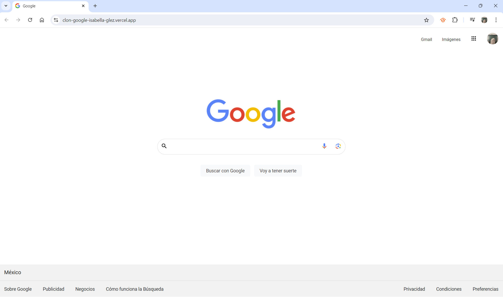
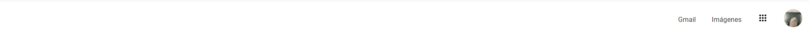
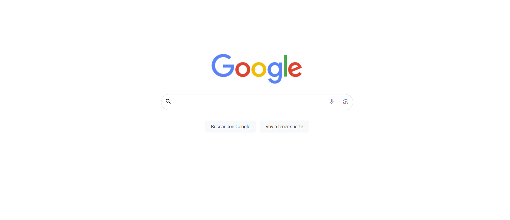
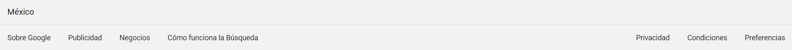

# ClonGoogle TECHNOLOCHICAS PRO

El presente proyecto es una pagina que imita la pagina de inicio de Google para poner en práctica las habilidades obtenidad dentro del bootcamp de desarrollo frontend de Technolochicas PRO. 

Fue desarrollado con HTML, CSS y Bootstrap. 

La página es responsiva (adaptable a diferentes tamaños de pantalla) e intenta ser lo mas similar a la página original de Google.

[Proyecto Desplegado](https://clon-google-isabella-glez.vercel.app/)

## Secciones de mi Sitio

## Tecnologias
*HTML
*CSS
*Bootstrap
_ _ _

Desarrollado con 💜 por [Isabella](https://www.instagram.com/isa_glezeli/) en [TECHNOLOCHICAS PRO](https://tecnolochicas.mx/).
